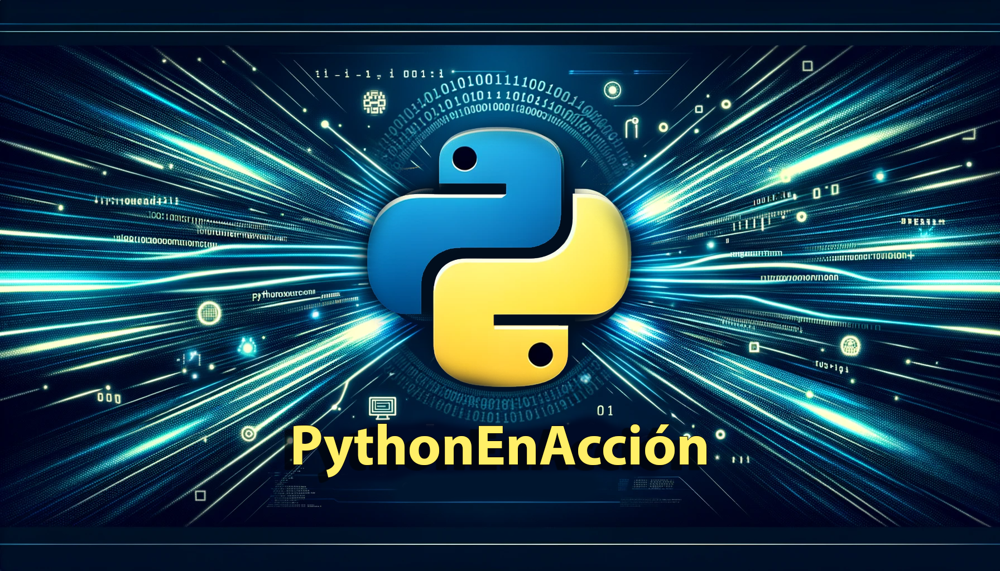

# PythonEnAccion

¡Bienvenidos a **PythonEnAccion**! Este repositorio es una colección exhaustiva de scripts en Python diseñados para hacer tu vida más fácil y productiva. Aquí encontrarás desde utilidades para automatización de tareas hasta soluciones para problemas complejos, todo en español.

## Objetivo

Como apasionado de la programación y el desarrollo, mi meta es crear un espacio de colaboración y aprendizaje continuo para la comunidad de Python. Este repositorio es una invitación a compartir, explorar y mejorar un sinfín de scripts útiles que sirven tanto para aplicaciones de desarrollo como para uso personal. Desde la descarga de videos y la conversión de archivos hasta el manejo avanzado de datos con pandas y la creación de visualizaciones complejas.

## Estructura del Repositorio

Aquí está la estructura del repositorio, donde cada categoría tiene su propio conjunto de scripts y un `README.md` para proporcionar contexto y guías de uso específicas:

- [Automatización de Tareas](automatizacion_de_tareas)
- [Descarga de Contenido](descarga_de_contenido)
- [Matemáticas y Ciencia de Datos](matematicas_y_ciencia_de_datos)
- [Conversión y Manipulación de Archivos](conversion_y_manipulacion_de_archivos)
- [Interacción con APIs y Web Scraping](interaccion_con_apis_y_web_scraping)
- [Visualización de Datos](visualizacion_de_datos)
- [Desarrollo Web y Flask](desarrollo_web)
- [Machine Learning y AI](machine_learning_y_ai)
- [Seguridad y Criptografía](seguridad_y_critpografia)
- [Utilidades Generales](utilidades_generales)

## Cómo Usar

Para comenzar, navega a la categoría de interés y lee el `README.md` correspondiente para entender cómo cada script puede facilitar tus tareas diarias.

## Cómo Contribuir

¿Interesado en contribuir? ¡Toda colaboración es bienvenida! Si tienes un script que quieres compartir o mejoras para proponer, por favor lee nuestro [archivo de contribución](URL_CONTRIBUTING.md) para más información.

## Licencia

Este proyecto está bajo la [Licencia MIT](URL_LICENSE.md). ¡Utiliza y comparte los scripts libremente!

## Agradecimientos

A todos los que contribuyen, usan y aprenden con este proyecto, ¡gracias!

---

## Sobre Mí 🚀

Hola, soy Javier Perez 👋

Desarrollador de Software con pasión por Python, Django, Flask, C#, Docker, HTML, CSS, Unity, SQL, PostgreSQL, MySQL.

- 🔭 Actualmente estoy trabajando como freelance y en proyectos personales.
- 🌱 Constantemente aprendiendo sobre nuevas tecnologías y mejores prácticas.
- 👯 Busco colaborar en proyectos interesantes y desafiantes.
- 💬 Pregúntame sobre Python, Django, Flask, C#, Docker, HTML, CSS, Unity, SQL, PostgreSQL, MySQL.
- 📫 Cómo contactarme: [playgames.j.g17@gmail.com](mailto:playgames.j.g17@gmail.com)

